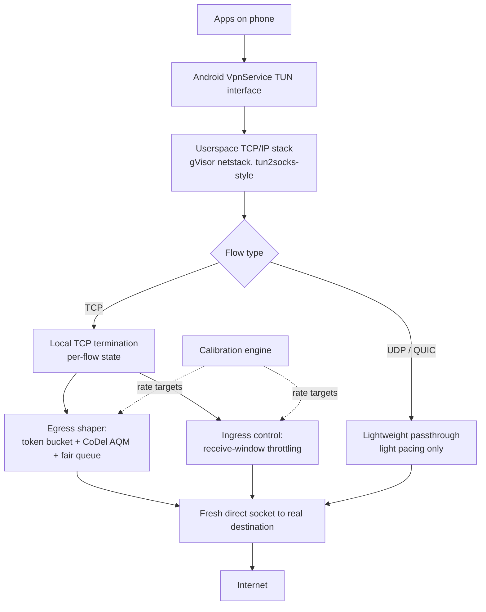

# Mobile Bufferbloat Shaper — Technical & Product Plan

> **Historical planning record — not the current implementation contract.** This
> document predates the fail-closed native-engine decision. Read
> [the current roadmap](docs/ROADMAP.md), [limitations](docs/LIMITATIONS.md),
> and [architecture](docs/ARCHITECTURE.md) for the source that is actually
> shipped. In particular, its historical `tun2socks` references are not an
> approved dependency: this project must not adopt GPL-only or proxy-dependent
> code for an Apache-2.0, local-only release.

## 0. The honest starting point

Rate-limiter apps already exist (Bandwidth Ruler, NetThrottle, and others). What none of them appear to do is real active queue management — they enforce a ceiling and then either queue or drop overflow with no real strategy, which is why "cap it and hope" only gets you a partial fix. The actual gap in this market, and the real value proposition for "groundbreaking," is three specific things nobody in the simple rate-limiter category does well:

1. **Real AQM** (CoDel-style controlled delay + per-flow fairness), not just a hard ceiling
2. **Auto-calibration** against a target that moves constantly on cellular, instead of a number you type in once
3. **Actual download-side shaping** via TCP receive-window control — the existing apps in this category don't even attempt download shaping on a direct (non-tethered) connection, because it requires a full local TCP termination, not just a packet counter

That's the product. Below is the architecture, the algorithms, the honest limits, and a phased build order.

**Explicitly out of scope:** this app cannot force carrier aggregation, NSA/SA selection, or band selection — those are network-scheduler decisions with no UE-side trigger, established separately. This is a bufferbloat/QoS tool only.

## 1. Product principles

- **Local-only, no remote server.** The VPN interface is used purely as Android's only sanctioned way to intercept all device traffic without root — not as an actual tunnel. Every connection terminates locally and opens a fresh, direct, normally-encrypted connection to the real destination. No traffic is routed through any company server. This is both the right privacy posture and it substantially simplifies Play Store policy compliance (see §9) since there's no remote endpoint or data collection surface to disclose beyond the on-device shaping itself.
- **Android first.** VpnService is capable enough for this; iOS's NetworkExtension (NEPacketTunnelProvider) can theoretically support a similar design but has tighter background execution limits and stricter review for VPN-branded apps. Treat iOS as a later phase, not a day-one parity target — "universal" here means universal *across Android devices/chipsets*, not universal across platforms.
- **Say what it can't do, in the app itself.** Download shaping has a real, protocol-level limit (§4). A trustworthy product states this instead of quietly underperforming on it.

## 2. Architecture



**Foundation:** don't hand-roll a TCP/IP stack — that's a multi-year mistake to attempt solo. Build on the gVisor netstack pattern (the same userspace stack used by `tun2socks`, an actively maintained, widely used open-source project for exactly this TUN→relay pattern on Android). It already ships a basic Token Bucket Filter qdisc for outbound shaping, which confirms the foundation supports rate control natively — you're extending it with real AQM and calibration, not building from zero. Its own docs are explicit that ingress and loopback traffic aren't shaped by that mechanism, which is the same asymmetry driving the ingress design in §4 — worth confirming directly against the library rather than taking my word for it once you're implementing.

This whole pipeline runs through Android's public `VpnService.Builder().establish()` API, which hands your process a TUN file descriptor without root. That's the standard, load-bearing mechanism — no elevated privileges needed for any of this.

## 3. Egress (upload) shaping — the solid half

This direction is fully controllable: the phone originates the traffic, so it decides exactly when to hand bytes to the radio. Three layers, standard in serious QoS implementations (this is essentially a userspace reimplementation of what `cake`/`fq_codel` do at the router level):

**Layer 1 — Token bucket.** Enforces the rate ceiling smoothly, with a small burst allowance (~20ms worth) so you're not perfectly rigid on every packet.

**Layer 2 — CoDel-style active queue management (RFC 8289).** This is the part a plain cap doesn't have. Track how long each packet actually sits in its queue (sojourn time). If sojourn time stays above a small target (5ms is the standard default) for a sustained interval (100ms default), start dropping packets — at an increasing rate the longer the backlog persists — rather than letting them queue indefinitely. This is what actually prevents your own shaper from becoming a second bufferbloat source: a queue that's actively kept shallow can't add hundreds of ms of latency, no matter how much data is offered to it.

**Layer 3 — Per-flow fairness (the "fq" in fq_codel).** Hash packets into separate sub-queues by flow (5-tuple), and serve those queues round-robin rather than one global FIFO. Otherwise a single greedy upload (a backup, a big attachment) starves out small latency-sensitive packets — TCP ACKs, DNS queries, a video call's audio stream — that happen to be sharing the link.

Reference implementation of the two core primitives (Kotlin, illustrative — a production build should validate against RFC 8289 and the Linux reference implementation for exact conformance):

```kotlin
/**
 * Token bucket — the base rate-enforcement primitive.
 * Tokens accumulate at rateBytesPerSec; each byte sent consumes a token.
 * Bucket capacity caps burst size so the shaper itself doesn't introduce bursts.
 */
class TokenBucket(
    private val rateBytesPerSec: Double,
    private val burstBytes: Long = (rateBytesPerSec * 0.02).toLong().coerceAtLeast(1500)
) {
    private var tokens: Double = burstBytes.toDouble()
    private var lastRefillNs: Long = System.nanoTime()

    @Synchronized
    fun tryConsume(bytes: Int): Boolean {
        refill()
        if (tokens < bytes) return false
        tokens -= bytes
        return true
    }

    @Synchronized
    fun nanosUntilAvailable(bytes: Int): Long {
        refill()
        val deficit = bytes - tokens
        return if (deficit <= 0) 0L
        else ((deficit / rateBytesPerSec) * 1_000_000_000L).toLong()
    }

    private fun refill() {
        val now = System.nanoTime()
        val elapsedSec = (now - lastRefillNs) / 1_000_000_000.0
        tokens = (tokens + elapsedSec * rateBytesPerSec).coerceAtMost(burstBytes.toDouble())
        lastRefillNs = now
    }
}

/**
 * Simplified CoDel active queue management (RFC 8289).
 * Call shouldDrop() once per packet at dequeue time.
 */
class CodelAqm(
    private val targetSojournMs: Long = 5,
    private val intervalMs: Long = 100
) {
    private var dropState = false
    private var firstAboveTargetNs = 0L
    private var dropCount = 0
    private var nextDropNs = 0L

    fun shouldDrop(sojournNs: Long, nowNs: Long): Boolean {
        val sojournMs = sojournNs / 1_000_000

        if (sojournMs < targetSojournMs) {
            firstAboveTargetNs = 0L
            dropState = false
            return false
        }

        if (firstAboveTargetNs == 0L) firstAboveTargetNs = nowNs
        val sustainedMs = (nowNs - firstAboveTargetNs) / 1_000_000
        if (sustainedMs < intervalMs) return false

        if (!dropState) {
            dropState = true
            dropCount = 1
            nextDropNs = nowNs
            return true
        }

        if (nowNs < nextDropNs) return false
        dropCount++
        val gapMs = (intervalMs / kotlin.math.sqrt(dropCount.toDouble())).toLong().coerceAtLeast(1)
        nextDropNs = nowNs + gapMs * 1_000_000
        return true
    }
}
```

Wire these together per-flow: one shared `TokenBucket` for the overall rate ceiling, one `CodelAqm` instance per flow-queue, serviced round-robin. Prefer ECN marking over dropping when both ends negotiate it (avoids the retransmit cost of a drop entirely) — treat it as an enhancement once the drop-based path is solid, not a v1 requirement.

## 4. Ingress (download) shaping — the hard half, done honestly

This is where the previous simple rate-limiter apps stop entirely, because the phone is the *receiver* here, not the sender — there's no clean interception point before the airtime and any upstream queueing has already happened. Two sub-cases:

**TCP — genuinely fixable.** Because your local relay fully terminates the TCP connection (three-way handshake, sequence numbers, the works) rather than blindly forwarding IP packets, it can advertise a smaller receive window back to the real server. That's standard TCP flow control, not a hack — it directly caps how much data the server is allowed to have in flight, which combined with round-trip time caps effective throughput. Critically, this operates at the transport layer, entirely below TLS — you're not touching encrypted payload, so this works without breaking HTTPS or triggering certificate issues.

**UDP/QUIC — a real, protocol-level wall.** QUIC deliberately moved flow-control and congestion signaling *inside* its encrypted transport parameters specifically to stop middleboxes from doing exactly what §4's TCP trick does — this was an intentional design goal to prevent protocol ossification. Manipulating it would require actually terminating TLS 1.3 locally (a full MITM: installing a local trusted cert, re-encrypting everything), which breaks certificate pinning in a lot of apps, is fragile, and — more importantly — is exactly the kind of behavior that would make a bandwidth-shaping app look like malware to anyone inspecting it. **Recommendation: don't do this.** Leave QUIC/UDP flows unshaped on ingress. This means large downloads over HTTP/3 (a growing share of major CDN and video traffic) won't get the same download-side benefit as TCP downloads. State this plainly in the app rather than let someone discover it disappointed. In practice this is a smaller gap than it sounds — QUIC's own congestion control is generally more bufferbloat-aware than older TCP stacks — but it's not a fix, just a mitigating factor.

## 5. Auto-calibration — replacing a static percentage with something that survives changing conditions

Your own earlier test data is the argument for why "80–90% of the average" needs refinement: two tests on the same phone, same location, same day, showed 92.7 vs 20.3 Mbps down and 13.3 vs 16.2 Mbps up. A simple arithmetic mean across samples that different produces a baseline that's either dangerously optimistic (if skewed by a lucky high sample) or needlessly conservative. Two changes:

**Use a low percentile of a rolling window, not the mean.** Target the ~20th–25th percentile of your last N samples (say, last 20–30 minutes of measured throughput), not the average. The goal is "safely below what I can realistically expect soon," not "below the middle of everything I've ever seen." Then apply the 80–90% headroom on top of *that*, not on top of a naive average.

**Recalibrate continuously, not once.** Two complementary mechanisms:
- *Passive*: continuously estimate achievable throughput from real, ongoing traffic — this is the same underlying idea BBR congestion control uses (periodically probe slightly above the current estimate, back off if it doesn't hold, otherwise adopt the higher estimate). Cheap, always running, no user-visible test needed.
- *Active*: trigger a short, lightweight measurement burst on real state-change signals — `TelephonyManager`/`ConnectivityManager` callbacks for RAT change (5G↔LTE), a cell handover, or a large enough passive-estimate swing — rather than on a fixed timer. This mirrors exactly the workflow you were already doing manually (re-running Waveform after conditions changed), just automated and triggered by the actual signal that conditions changed instead of a clock.

## 6. Built-in validation — make the fix visible

Bake a simple idle-vs-loaded latency test directly into the app (ping under idle conditions, then again while saturating up/down — the same general methodology behind every public bufferbloat test, not proprietary to any one tool). Run it automatically before and after enabling shaping, and show the before/after numbers side by side. This does double duty: it's a genuinely useful feature, and it's your own regression test during development — every algorithm change should visibly move this number in the right direction before it ships.

## 7. Engineering roadmap

| Phase | Scope | Why this order |
|---|---|---|
| 0 — Prototype | Manual rate entry, token bucket only, egress only | Validates the basic pipe (VpnService → netstack → relay) works at all before adding complexity |
| 1 — Real AQM | Add CoDel + per-flow fairness to egress | This alone already beats every existing app in this category, none of which appear to implement real AQM |
| 2 — Calibration | Replace manual entry with passive+active auto-calibration | Removes the "static number" fragility; makes the app usable without manual tuning |
| 3 — Download shaping | Full local TCP termination + receive-window control | Biggest engineering lift, biggest differentiator; UDP/QUIC explicitly out of scope per §4 |
| 4 — Adaptive smart mode | Detect flow type (bulk transfer vs. call/game traffic) and widen shaping headroom automatically when latency-sensitive flows are active | Real "smart" differentiation beyond a static percentage knob |
| 5 — Production hardening | Foreground service UX, battery budget, crash/telemetry, store compliance (§9), built-in test polish (§6) | Everything above only matters if it survives real-world battery and reliability constraints |

Don't skip to Phase 3 early — Phases 0–1 are what make the core loop trustworthy, and Phase 3 is meaningfully harder to debug if the foundation underneath it is shaky.

## 8. Definition of "flawless" — concrete targets

- Under saturating load, added latency stays under ~30ms (roughly A/B territory on a Waveform-style grade, versus the F/D grades a raw connection or a naive cap tends to produce)
- Throughput retention at or above the ~85–90% headroom target, not meaningfully worse
- Additional battery overhead from the always-on relay kept to a low single-digit percentage during active data use — a userspace packet-relay adds real CPU cost, budget for it explicitly rather than discover it late
- VPN tunnel itself stays up reliably across RAT changes and handovers — a shaper that silently drops the tunnel during a handover is worse than no shaper

## 9. Production & publishing considerations

- Google Play requires apps using `VpnService` to disclose this prominently in the app itself (not just the store listing) and has restricted its use to core-VPN apps or specific categories including network tools — this app fits that "network tools" carve-out, but get the exact declaration language reviewed against current policy before submission, not assumed from this document.
- As of recent policy updates, VPN-category apps are being required to register under an **Organization** developer account rather than an individual one — budget for that setup step.
- Traffic redirection for monetization (ad rerouting, data reselling) is explicitly banned and would also undercut the entire trust proposition of a bufferbloat tool — keep monetization to clean one-time/subscription models, nothing that touches the relayed traffic itself.
- Because this design never routes traffic through a remote server, the disclosure story is genuinely simpler than a typical VPN's — but that's a claim to get confirmed by someone reading the actual current policy text against your specific implementation, not something to assume from general guidance. This document isn't legal review.
- iOS (NEPacketTunnelProvider): architecturally similar option exists, but background execution limits and stricter review for VPN-branded apps make it a real phase-2+ effort, not a parity requirement for launch.

## 10. What to tell users, upfront, permanently

- This does not force 5G SA, NSA, or carrier aggregation — that's a separate, network-controlled problem.
- Download shaping is strong for TCP, effectively absent for QUIC/UDP-heavy downloads — stated plainly, not discovered.
- The chosen rate is a statistical bet on near-future conditions, not a guarantee — cellular capacity moves, and a very sudden drop below the target can still produce a bad moment before recalibration catches up.
